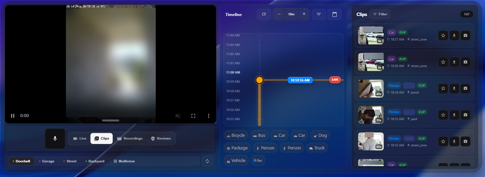

# Sightline for Frigate



A modern, responsive Frigate NVR card for Home Assistant.

Sightline brings your Frigate cameras, live view, timeline, clips, recordings, reviews, downloads, filters, face recognition results, and two-way audio into one Lovelace card. It is designed to work equally well as a compact dashboard card or as a full-width camera workstation.

> [!NOTE]
> Sightline is a community Home Assistant card built for Frigate. It is not the Frigate Home Assistant integration itself. You need a working Frigate installation and the Frigate Home Assistant integration before installing Sightline. I also want to be upfront and say this card is vibe coded. Any suggestions or code reviews are welcome.

## Features

- WebRTC live view with HLS fallback
- Continuous recording playback and timeline seeking
- Clips, Recordings, and Reviews browsers
- Configurable startup tab with optional autoplay of the newest retained clip
- Frigate detection thumbnails and Material Design detection glyphs
- Configurable timeline thumbnail size
- Filters for labels, zones, review state, and recognized faces
- Timeline range selection for downloading recording clips
- Two-way audio for compatible go2rtc camera streams
- Multi-camera support for up to 4 Frigate cameras
- Single-camera, Multiview, and auto-rotation modes
- Full-card clip playback from grid/Multiview with an obvious return-to-live control
- Responsive wide-screen layout: video, timeline, and media browser can sit side-by-side
- iOS-inspired translucent/glass styling with configurable theme, tint, accent, and transparency
- Home Assistant visual card editor plus full YAML configuration
- Home Assistant 12/24-hour time and timezone awareness
- Designed to use the authenticated Home Assistant Frigate integration proxy rather than direct browser connections to Frigate

## Requirements

Before installing Sightline, make sure you have:

1. **Home Assistant** with dashboards enabled.
2. **Frigate NVR** running and configured with your cameras.
3. The **Frigate Home Assistant integration** installed and connected to the same Frigate instance.
4. **HACS** if you want to use the recommended installation method.
5. For WebRTC, a usable Frigate/go2rtc stream for the camera.

The official Frigate Home Assistant integration is available through HACS and requires MQTT to be configured between Frigate and Home Assistant. See the Frigate integration documentation for setup details:

https://docs.frigate.video/integrations/home-assistant/

## Installation

### HACS — recommended

Until Sightline is included in the default HACS catalog, add it as a custom Dashboard repository:

1. Open **HACS** in Home Assistant.
2. Open the **⋮** menu in the upper-right corner.
3. Select **Custom repositories**.
4. Paste the GitHub URL for this repository.
5. Select **Dashboard** as the repository type.
6. Select **Add**.
7. Search for **Sightline for Frigate** in HACS and download it.
8. Refresh Home Assistant after installation.

HACS should register the JavaScript resource automatically. If Home Assistant says `Custom element doesn't exist: sightline-card`, see [Troubleshooting](#troubleshooting).

### Manual installation

1. Download `dist/sightline-for-frigate.js` from the latest release/repository.
2. Copy it to:

   ```text
   /config/www/sightline-for-frigate/sightline-for-frigate.js
   ```

3. In Home Assistant, go to **Settings → Dashboards → ⋮ → Resources**.
4. Add the following resource as a **JavaScript module**:

   ```text
   /local/sightline-for-frigate/sightline-for-frigate.js
   ```

5. Refresh Home Assistant.

## Add Sightline to a dashboard

After installation, edit a Home Assistant dashboard and select **Add card**. Search for **Sightline for Frigate**. The visual editor will only offer camera entities belonging to the Frigate Home Assistant integration.

You can also add the card directly with YAML:

```yaml
type: custom:sightline-card
cameras:
  - entity: camera.front_door
```

Replace `camera.front_door` with the Frigate camera entity created by your Home Assistant Frigate integration.

## Recommended starter configuration

This is a good starting point for a single camera:

```yaml
type: custom:sightline-card
window_hours: 24
refresh_seconds: 30
theme: auto
transparency: 20
stream_type: webrtc
aspect_ratio: auto
stream_resizable: true
cameras:
  - entity: camera.front_door
    name: Front Door
    go2rtc_stream: front_door
```

If your Frigate camera name and go2rtc stream name are the same, `go2rtc_stream` can usually be omitted.

## Multiple cameras

Sightline supports up to four Frigate cameras:

```yaml
type: custom:sightline-card
default_view: multiview
cameras:
  - entity: camera.front_door
    name: Front Door
    go2rtc_stream: front_door

  - entity: camera.driveway
    name: Driveway
    go2rtc_stream: driveway

  - entity: camera.back_yard
    name: Back Yard
    go2rtc_stream: back_yard
```

With multiple cameras configured you can switch cameras, use Multiview, or enable automatic rotation. Set `default_view: multiview` to launch directly into the all-camera grid. The legacy value `default_view: grid` remains accepted for backward compatibility. Camera filters are hidden automatically when the card is operating in a single-camera context.

When you open a clip while in grid/Multiview, Sightline temporarily gives playback the full card instead of squeezing the clip into one grid tile. Use the **Back to Multiview** control over the player to return to the camera grid.

### Multiple Frigate instances

If Home Assistant has more than one Frigate integration instance, set the Frigate client/instance ID on each camera that needs it:

```yaml
cameras:
  - entity: camera.front_door
    frigate_client_id: frigate_main
    go2rtc_stream: front_door
```

## Live stream configuration

Sightline supports two live stream modes:

| Value | Description |
| --- | --- |
| `webrtc` | Default. Low-latency live playback through Frigate/go2rtc and the Home Assistant integration proxy. |
| `hls` | Compatibility fallback if WebRTC is unavailable for a camera/browser. |

Example:

```yaml
stream_type: webrtc
aspect_ratio: auto
stream_resizable: true
```

### Aspect ratio and stream height

`aspect_ratio` controls the player size when `stream_height` is not set. `auto` uses the selected camera/video dimensions when available.

```yaml
aspect_ratio: auto
```

Supported examples include:

```yaml
aspect_ratio: "16:9"
aspect_ratio: "4:3"
aspect_ratio: "1:1"
aspect_ratio: "21:9"
aspect_ratio: "9:16"
aspect_ratio: "3:2"
```

To force the live area to a viewport-relative height instead, set `stream_height`:

```yaml
stream_height: 50
```

That means `50vh`. An explicit `stream_height` intentionally overrides `aspect_ratio` for the player height.

## Responsive / full-dashboard layout

Sightline adapts to the **width of the card itself**, not only the browser window.

On narrow dashboards, the live view, timeline, and media browser stack vertically. On wider cards, Sightline moves the timeline beside the video. On very wide cards, opening Clips, Recordings, or Reviews adds the selected media browser as another column:

```text
Video  |  Timeline  |  Clips / Recordings / Reviews
```

The media browser has its own history/query range, so opening a 24-hour Clips browser does not change the timeline zoom or position.

## Timeline

The timeline can display recording availability, Frigate detections, event thumbnails, detection glyphs, and a precise playhead. The left-side scale follows Home Assistant's 12/24-hour time preference without seconds, while the active playhead keeps second-level precision.

Example timeline configuration:

```yaml
timeline:
  enabled: true
  default_minutes: 10
  show_thumbnails: true
  thumbnail_size: 84
  show_glyphs: true
  show_legend: true
  show_zoom_controls: true
  show_filter_button: true
  show_calendar_button: true
  clustering: true
  same_label_cluster_seconds: 12
  visual_cluster_max_seconds: 60
  glyph_min_px: 20
  glyph_max_px: 30
  max_glyphs: 3
  max_thumbnails: 12
```

### Timeline options

| Option | Default | Description |
| --- | ---: | --- |
| `enabled` | `true` | Show the timeline on Live. |
| `default_minutes` | `10` | Initial timeline window in minutes. |
| `show_thumbnails` | `true` | Show event/review thumbnails. |
| `thumbnail_size` | `84` | Timeline thumbnail height in pixels. Valid range: 48–140. |
| `show_glyphs` | `true` | Show detection icons. |
| `show_legend` | `true` | Show the detection legend. |
| `show_zoom_controls` | `true` | Show timeline zoom controls. |
| `show_filter_button` | `true` | Show timeline filters. |
| `show_calendar_button` | `true` | Show date/calendar control. |
| `clustering` | `true` | Visually cluster nearby detections. |
| `same_label_cluster_seconds` | `12` | Merge nearby detections of the same label. |
| `visual_cluster_max_seconds` | `60` | Maximum gap for visual burst clustering. |
| `glyph_min_px` | `20` | Minimum responsive glyph size. |
| `glyph_max_px` | `30` | Maximum responsive glyph size. |
| `max_glyphs` | `3` | Maximum glyphs displayed for a burst. |
| `max_thumbnails` | `12` | Maximum visible timeline thumbnails. `0` hides them. |

## Filters and face recognition

Sightline can filter Frigate media by object label, zone, review state, camera when multiple cameras are relevant, and recognized face.

Frigate stores a recognized person's name as the `sub_label` on a `person` event. Sightline exposes those recognized names in a separate **Face** filter instead of creating confusing labels such as `person-verified`.

For example, the Label filter can remain:

```text
Person · Car · Dog
```

while the Face filter can contain:

```text
Alice · Bob · Visitor
```

The Face filter appears when Frigate has reported recognized sub-labels. Face recognition itself must be configured in Frigate:

https://docs.frigate.video/configuration/face_recognition/

## Clips, Recordings, and Reviews

Sightline includes separate media browsers for:

- **Clips** — event-oriented Frigate media.
- **Recordings** — continuous recording playback.
- **Reviews** — Frigate review segments and review state.

You can choose which tab is shown when the card first loads:

```yaml
default_tab: clips
```

Valid values are `live`, `clips`, `recordings`, and `reviews`. If the configured default tab is also listed in `hidden_tabs`, Sightline falls back to Live.

When `default_tab: clips` is used, Sightline can optionally open and autoplay the newest retained clip after the initial media load:

```yaml
autoplay_latest_clip: true
```

This startup autoplay runs once and only selects an event that Frigate reports as having a retained clip.

The initial browser history range is controlled with:

```yaml
window_hours: 24
```

The background metadata refresh interval is controlled with:

```yaml
refresh_seconds: 30
```

Reviews can default to all, reviewed, or unreviewed:

```yaml
media:
  reviewed_default: all
```

When recorded playback is active, Sightline displays a clear **Back to Live** control over the player. If the clip was opened from grid/Multiview, the control becomes **Back to Multiview** and restores the grid.

## Download a recording range

Use the download control on the timeline to select a start/end range and export that portion of the continuous recording.

```yaml
download:
  default_range_seconds: 60
  max_range_minutes: 120
```

The range handles are touch-friendly and work independently of timeline scrubbing.

## Two-way audio

For supported cameras, Sightline can expose a push-to-talk microphone control through Frigate/go2rtc.

```yaml
two_way_audio: true
two_way_audio_disconnect_seconds: 90
```

Two-way audio requires:

- A Frigate/go2rtc stream configured for two-way audio.
- A microphone/audio-input device on the client.
- Browser microphone permission.
- HTTPS or localhost, as required by browser media APIs.

The microphone button stays hidden when no audio input is detected or microphone permission is unavailable.

## Appearance and glass/transparency settings

Sightline can follow Home Assistant or use an explicit light/dark theme:

```yaml
theme: auto
```

Available values are `auto`, `dark`, and `light`.

You can also set a custom accent and background tint:

```yaml
accent_color: "#ffffff"
bg_color: "#020818"
```

`transparency` controls how much of the Lovelace wallpaper/theme is visible through Sightline's surfaces:

```yaml
transparency: 80
```

The range is `0` to `100`:

- `0` keeps the normal card material.
- Higher values reveal more of the dashboard background.
- `100` makes the main material surfaces as transparent as possible while keeping controls/text visible.
- The actual camera/video image remains opaque.

If `bg_color` is set, that color becomes the tint for the translucent card surfaces.

## Main configuration reference

| Option | Default | Description |
| --- | --- | --- |
| `cameras` | required | One to four Frigate camera definitions. |
| `window_hours` | `24` | Initial media-browser history range. |
| `refresh_seconds` | `45` | Frigate metadata/event refresh interval. Minimum 15 seconds. |
| `default_view` | `single` | `single` or `grid` when multiple cameras exist. |
| `default_tab` | `live` | Initial tab: `live`, `clips`, `recordings`, or `reviews`. |
| `autoplay_latest_clip` | `false` | When starting on Clips, automatically open the newest retained clip once. |
| `rotate_on_load` | `false` | Begin automatic camera rotation. |
| `rotate_seconds` | `0` | Rotation interval; `0` uses Sightline's 30-second default. |
| `hidden_tabs` | `[]` | Hide `clips`, `recordings`, and/or `reviews`. Live is always available. |
| `stream_type` | `webrtc` | `webrtc` or `hls`. |
| `aspect_ratio` | `auto` | Automatic, preset, or custom `W:H` player ratio. |
| `stream_height` | unset | Explicit player height in `vh`; overrides aspect-ratio height. |
| `stream_resizable` | `false` | Allow drag-resizing of the live view. |
| `theme` | `dark` | `dark`, `light`, or `auto`. |
| `accent_color` | unset | Custom accent color. |
| `bg_color` | unset | Custom card/glass tint. |
| `transparency` | `0` | Surface transparency from 0–100%. |
| `two_way_audio` | `false` | Enable push-to-talk when supported. |
| `two_way_audio_disconnect_seconds` | `90` | Delay before closing the talk WebRTC session after release. |

### Camera object

Each entry in `cameras:` supports:

| Key | Required | Description |
| --- | --- | --- |
| `entity` | Yes | Frigate `camera.*` entity from Home Assistant. |
| `name` | No | Optional display name. |
| `frigate_client_id` | No | Frigate integration instance/client ID, useful with multiple Frigate servers. |
| `go2rtc_stream` | No | Override the go2rtc stream name if it differs from the Frigate camera name. |

## Complete example

```yaml
type: custom:sightline-card
window_hours: 24
rotate_seconds: 0
refresh_seconds: 15
accent_color: "#ffffff"
bg_color: "#020818"
theme: dark
default_view: single
default_tab: live
autoplay_latest_clip: false
rotate_on_load: false
hidden_tabs: []
stream_height: 40
stream_type: webrtc
stream_resizable: true
aspect_ratio: auto
transparency: 80

timeline:
  enabled: true
  default_minutes: 10
  show_thumbnails: true
  thumbnail_size: 84
  show_glyphs: true
  show_legend: true
  show_zoom_controls: true
  show_filter_button: true
  show_calendar_button: true
  clustering: true
  same_label_cluster_seconds: 12
  visual_cluster_max_seconds: 60
  glyph_min_px: 20
  glyph_max_px: 30
  max_glyphs: 3
  max_thumbnails: 12

download:
  default_range_seconds: 60
  max_range_minutes: 120

media:
  reviewed_default: all

two_way_audio: true
two_way_audio_disconnect_seconds: 90

cameras:
  - entity: camera.front_door
    name: Front Door
    go2rtc_stream: front_door
```

## Network and privacy model

Sightline is designed so the browser does **not** need a direct Frigate server URL or go2rtc server URL in the card configuration. Frigate media/API requests are routed through the authenticated Home Assistant Frigate integration endpoints.


## Updating

If installed through HACS, update Sightline from HACS like any other Dashboard repository. After updating a frontend card, refresh/reload Home Assistant in your browser if the old JavaScript is still displayed.

If installed manually, replace `sightline-for-frigate.js` with the new release and refresh Home Assistant.

## Troubleshooting

### `Custom element doesn't exist: sightline-card`

Confirm the resource is loaded in **Settings → Dashboards → ⋮ → Resources**.

For a HACS install, the resource should resolve from the Sightline HACS directory, normally:

```text
/hacsfiles/sightline-for-frigate/sightline-for-frigate.js
```

The resource type must be **JavaScript module**. Then refresh Home Assistant and reopen the dashboard editor.

### My Frigate camera is missing from the visual editor

Sightline intentionally filters the camera selector to entities owned by the **Frigate Home Assistant integration**. Check that the camera exists under the Frigate integration in **Settings → Devices & Services** and is not disabled.

An already-saved Frigate camera is preserved in the editor even if it is temporarily unavailable.

### WebRTC does not start

Make sure the camera has a working go2rtc stream in Frigate. If its go2rtc stream name differs from the Frigate camera name, configure `go2rtc_stream` for that camera. You can also test with:

```yaml
stream_type: hls
```

### Clips, recordings, or reviews are empty

First confirm the same camera has media available in Frigate itself and that the Home Assistant Frigate integration is connected. Sightline obtains Frigate data through Home Assistant rather than connecting the browser directly to your Frigate host.

### Two-way audio button is missing

The button is deliberately hidden unless two-way audio is enabled **and** the browser detects a microphone. Check microphone permission, HTTPS/localhost requirements, and your go2rtc two-way-audio source.

### Something changed but the dashboard still shows the old version

Refresh Home Assistant after updating the JavaScript resource. If necessary, close/reopen the Home Assistant app or perform a hard browser refresh.


The existing Sightline/Frigate Modern configuration schema is otherwise preserved.

## Support

If you find a bug, include as much of the following as possible when opening a GitHub issue:

- Sightline version
- Home Assistant version
- Frigate version
- Browser / Home Assistant Companion App platform
- Relevant card YAML with private addresses/names removed if needed
- Screenshot or short screen recording
- Browser console error, if one is present

For Frigate installation or Frigate integration problems that also occur outside Sightline, use the Frigate documentation/support channels. For behavior specific to this card, open an issue in the Sightline repository.
